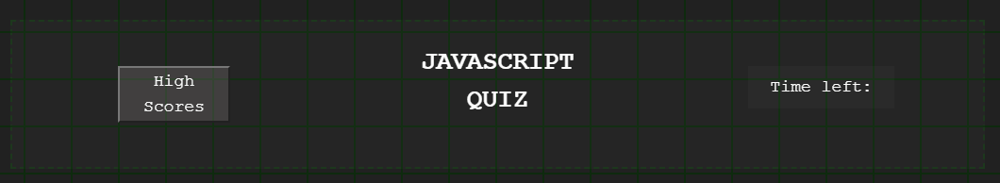
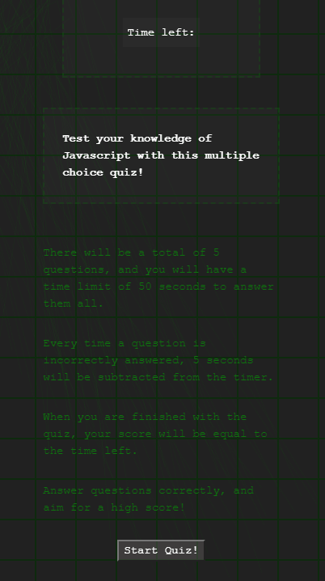
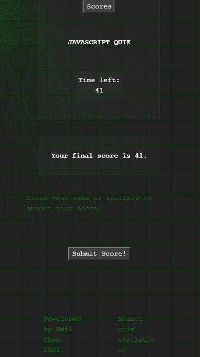

# Javascript Quiz

This is a multiple choice quiz web application that tests your knowledge on Javascript. Play a deployed version <a href="https://inknsharps.github.io/javascript_quiz/">here</a>!

## Gameplay Description

Users can challenge their knowledge of Javascript by playing through this quiz. When the game starts, a timer ticks down from 50 seconds, and the user will need to answer all the questions in the given time. When the user clicks an answer, a message will appear showing if they've answered correctly or incorrectly. If a question was answered incorrectly, the timer will decrease by 5 seconds, so make sure to answer carefully! Your final score will be equal to the time left.

Once the questions are complete, or the timer hits 0, a game end screen will appear where the user can submit their score to the leaderboard. At the leaderboard, the user can choose to clear the leaderboard, and/or return to the main menu and play the quiz again.

## Features

* One click buttons to navigate through the menus, to initialize the quiz, to select an answer, and submit a score.
* Persistent high score leaderboards through use of the `Window.localStorage` object, which can be cleared if desired.
* High score leaderboards automatically sort through the submitted scores, and only display the top 4 scores.
* Don't want to submit your name to the leaderboard? The app will generate a random anonymous name if you leave the field blank when submitting your score.
* Randomly generated backgrounds every time you run the app!
* Designed with mobile-first in mind, so compatible with mobile devices and computers.

## Demos

### Gameplay loop demo

### Anonymous Animal Names

## Credits

* Questions and answers from the <a href="https://www.tutorialspoint.com/javascript/javascript_online_quiz.htm">Tutorials Point Javascript Website</a>.
* CSS reset file based off of the <a href="https://github.com/hankchizljaw/modern-css-reset">Modern CSS reset</a> by Andy Bell/hankchizljaw.
* <a href="https://p5js.org">p5.js</a>, which was the library used to code the generated background effects.